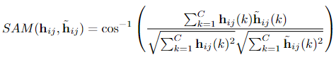
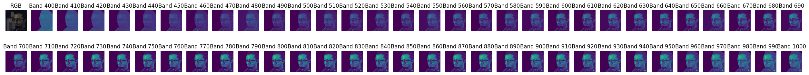

## Loading data
We provided a function module to load the Hyper-Skin data. The provided script is available [hsiData/HyperSkinData.py](hsiData/HyperSkinData.py).
The following code explains how to load the data from **Hyper-Skin(RGB,VIS)** with `HyperSkinData.Load_rgbvis`

```python
from hsiData import HyperSkinData

data_dir = 'ICASSP2024-SPGC/Hyper-Skin(RGB,VIS)'
rgb_dir = f'{data_dir}/train/RGB_CIE'
vis_dir = f'{data_dir}/train/VIS'

train_dataset = HyperSkinData.Load_rgbvis(
    hsi_dir = vis_dir,
    rgb_dir = rgb_dir, 
)

```

To load the data from **Hyper-Skin(MSI,NIR)**, simply change the  `HyperSkinData.Load_rgbvis` with `HyperSkinData.Load_msinir`.

Refer to the python notebook ([data_loading.ipynb](data_loading.ipynb)) for the example on data loading.

## Baseline
We use the MST++ published in CVPRW 2022 as the baseline model [1]. This model was the winning method for spectral reconstruction problem on natural scenes organized by NTIRE2022 competition. You can check out the [paper](https://arxiv.org/abs/2204.07908) to learn more about the model design.

The model is provided by the authors of MST++ in their [Github-repo](https://github.com/caiyuanhao1998/MST-plus-plus). For the ease of access, we have included the model in pytorch format under the [baseline-folder](baseline/MST_Plus_Plus.py). 
To use the model, we can call the model as follows:

```python
model_architecture = MST_Plus_Plus.MST_Plus_Plus(in_channels=3, out_channels=31, n_feat=31, stage=3)
```

## Evaluation
Spectral Angle Mapper (SAM) will be used to evaluate the reconstructed spectral at every pixel of a human image. An average SAM score will be calculated for each image and the average SAM score will be used to evaluate the performance of the model. The lower the SAM score, the better the model is. 
Let $`\mathbf{h}_{ij} = H(i, j, :) \in \mathbb{R}^C`$ be a $C$-dimensional groundtruth spectra at pixel $i$ and $j$, and $`\tilde{\mathbf{h}}_{ij}`$ the reconstructed spectra, we can compute the SAM between these 2 spectra vectors at a pixel location $i$ and $j$ as follows:

<!-- ```math
    SAM(\mathbf{h}_c, \tilde{\mathbf{h}}_{c}) = \cos^{-1} \left(  \frac{ \sum_{k = 1}^{C} \mathbf{h}_c(k) \tilde{\mathbf{h}}_{c}(k) }{ \sqrt{ \sum_{k = 1}^{C} \mathbf{h}_c(k)^2} \sqrt{\sum_{k = 1}^{C} \tilde{\mathbf{h}}_{c}(k)} } \right) ,
``` -->
<!--  -->
<p align="center">
  
</p>


where $`\mathbf{h}_{ij}(k)`$ denote the pixel value at band $k$ for a spectra vector located at $i$ and $j$ of the HSI cube.
Suppose that there are $N$ pixels in the HSI cube belong to the human subject excluding the background, the average SAM score for the HSI cube can be computed as follows:


```math
    SAM_{avg} = \frac{1}{N} \sum_{i = 1}^{N} SAM(\mathbf{h}_{ij}, \tilde{\mathbf{h}}_{ij}) 
```

The leaderboard score will be the average of all $`SAM_{avg}`$  in the test set. The code for the SAM is available as `sam_fun(pred, target)` in [utils.py](utils.py). Two outputs will be returned by the function, the first output `score` is the average SAM score for the HSI cube, and the second output `map` is the SAM score for each pixel in the HSI cube.

## Evaluation Results with Baseline Model
The evaluation code is provided as [evaluation.py](evaluation.py).
Use the following command to run the evaluation code:
```
python evaluation.py --data_dir {data_dir} --model_name {model_name} --models_dir {models_dir} --results_dir {results_dir} 
```
where data_dir (*str, required*) is the path to the data folder, the model_name is the name of the model to be evaluated, the models_dir is the path to the folder that contains the trained model, and the results_dir is the path to the folder to save the evaluation results.

There are a total of 54 test samples from 9 subjects. 
The trained baseline model is provided in the [models folder](models/mstpp.pt). The network architecture is provided in [baseline folder](baseline/MST_Plus_Plus.py). The baseline is based on the MST++ model published in CVPRW 2022 [1]. 
The average SAM score for all the test samples is 0.1182 +/- 0.0200.   
The following table shows the average SAM score for each subject and the average SAM score for all the test samples. 

| Test Name | Average SAM Score |
| :---: | :---: |
| p001_neutral_front  | 0.1185    |
| p001_neutral_left   | 0.1172    |
| p001_neutral_right  | 0.1200    |
| p001_smile_front    | 0.1209    |
| p001_smile_left     | 0.1208    |
| p001_smile_right    | 0.1244    |
| p002_neutral_front  | 0.1379    |
| p002_neutral_left   | 0.1357    |
| p002_neutral_right  | 0.1337    |
| p002_smile_front    | 0.1359    |
| p002_smile_left     | 0.1375    |
| p002_smile_right    | 0.1342    |
| p003_neutral_front  | 0.1533    |
| p003_neutral_left   | 0.1443    |
| p003_neutral_right  | 0.1619    |
| p003_smile_front    | 0.1586    |
| p003_smile_left     | 0.1574    |
| p003_smile_right    | 0.1599    |
| p012_neutral_front  | 0.1392    |
| p012_neutral_left   | 0.1397    |
| p012_neutral_right  | 0.1411    |
| p012_smile_front    | 0.1394    |
| p012_smile_left     | 0.1395    |
| p012_smile_right    | 0.1396    |
| p016_neutral_front  | 0.1057    |
| p016_neutral_left   | 0.1031    |
| p016_neutral_right  | 0.1095    |
| p016_smile_front    | 0.1084    |
| p016_smile_left     | 0.1061    |
| p016_smile_right    | 0.1109    |
| p030_neutral_front  | 0.1021    |
| p030_neutral_left   | 0.1058    |
| p030_neutral_right  | 0.1043    |
| p030_smile_front    | 0.1029    |
| p030_smile_left     | 0.1038    |
| p030_smile_right    | 0.1049    |
| p035_neutral_front  | 0.0997    |
| p035_neutral_left   | 0.1059    |
| p035_neutral_right  | 0.0993    |
| p035_smile_front    | 0.1030    |
| p035_smile_left     | 0.1029    |
| p035_smile_right    | 0.0989    |
| p036_neutral_front  | 0.0940    |
| p036_neutral_left   | 0.0961    |
| p036_neutral_right  | 0.0990    |
| p036_smile_front    | 0.0948    |
| p036_smile_left     | 0.0956    |
| p036_smile_right    | 0.1022    |
| p039_neutral_front  | 0.0941    |
| p039_neutral_left   | 0.1032    |
| p039_neutral_right  | 0.1060    |
| p039_smile_front    | 0.0987    |
| p039_smile_left     | 0.1057    |
| p039_smile_right    | 0.1059    |

Example of reconstructed HSI cube is as follows:



## References

[1] Yuanhao Cai, Jing Lin, Zudi Lin, Haoqian Wang, Yulun Zhang, Hanspeter Pfister, Radu Timofte, and Luc Van Gool, “Mst++: Multi-stage spectral-wise transformer for efficient spectral reconstruction,” in Proceedings of the IEEE/CVF Conference on Computer Vision and Pattern Recognition, 2022, pp. 745–755.
